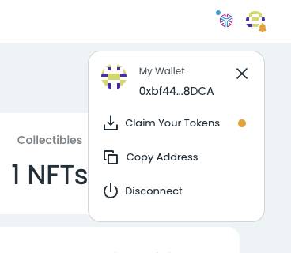
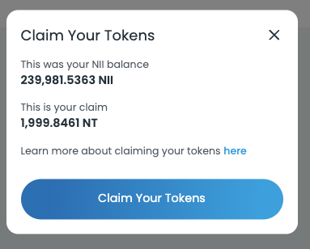

# NII Token Reissue

This repository contains the collated snapshot data of Nahmii (NII) token holders
prior to the [security incident on 19th September 2024](https://blog.nahmii.io/security-incident-update-nii-token-reissue-and-niifi-token-swap-9e54b08bfe48).
The snapshot was taken at the following block heights for each network:

- Nahmii 1.0: Final Claim Payloads
- Ethereum Mainnet: 20780057
- Nahmii 2.0: 44510
- Nahmii 3.0: 12731

## Nahmii Network Token (NT)

Name: Nahmii Network  
Symbol: NT  
Decimals: 18  
 
Total Supply: 1,000,000,000 (1 Billon) 
 
ETH (L1) Address: [0x94F82266C8f64e4c7108406f84E38498141c8211](https://etherscan.io/token/0x94F82266C8f64e4c7108406f84E38498141c8211) 
Nahmii 3.0 (L2) Address: [0xD1fA9C6Ef9Dda12b460632c0874CFf11394DDF95](https://explorer.nahmii.io/address/0xD1fA9C6Ef9Dda12b460632c0874CFf11394DDF95) 

## NII &#8594; NT Allocation

Given the change in both total supply and decimal value, the wei token balance to be reissued
**will not be 1:1 with your old holdings but your fractional ownership remains unchanged.**

<table>
  <tr>
    <th></th>
    <th>Old (NII)</th>
    <th>New (NT)</th>
  </tr>
  <tr>
    <td>Decimals</td>
    <td>15</td>
    <td>18</td>
  </tr>
  <tr>
    <td>Total Supply</td>
    <td>120 Billion (120B)</td>
    <td>1 Billion (1B)</td>
  </tr>
</table>

### Example: Token & Wei Balance

- User has 5_000_000 (5 Million) NII snapshot allocation.
    - Wei value of 5_000_000_000_000_000_000_000.

- User will receive 1/120 of the original value.
    - 5_000_000 / 120 = 41_666 NT
    - Wei value of 41_666_666_666_666_666_666_666.

- Fractional ownership is maintained
    - 5M / 120B = **0.0000416% of OLD supply**
    - 41666 / 1B = **0.0000416% of NEW supply**

## Claiming your NT Tokens

### Account Page (Recommended)

1. Visit the Nahmii Account Page at https://accounts.nahmii.io/.

2. Connect your wallet and select 'Claim your Tokens' from the account dropdown.
    - _Note: Only eligible wallets will show this link. See `snapshot.csv` for eligible wallets._

  

3. The claim modal will show your calculated NII snapshot balance and your allocated NT token claim.

4. Click 'Claim your Tokens' and confirm the Metamask transaction when prompted.

  

## Questions?

Reach out to us on the [Nahmii Discord channel](https://discord.com/invite/GKTsUTH)
